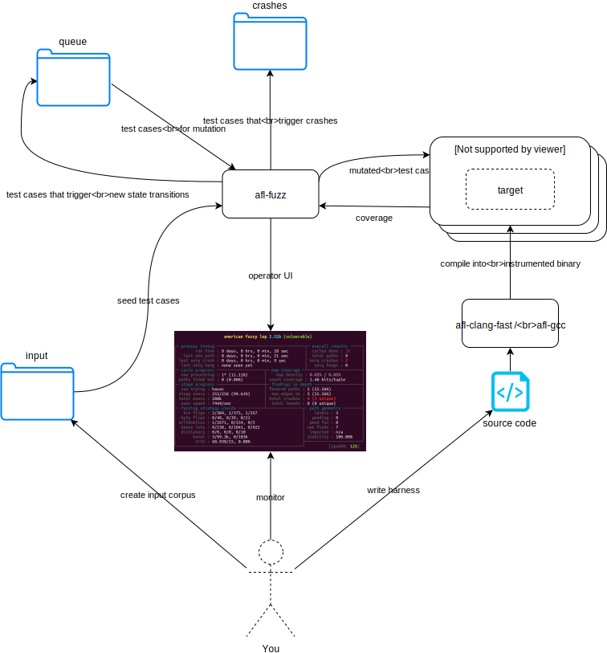

This small exercise is about writing a harness around a bit of code to allow it to be fuzzed with afl. Whilst there is a discoverable crash, the goal here is to learn about the plumbing to interface AFL with a target bit of code.

If you were comfortable with what was happening when fuzzing the `vulnerable` quickstart program, and understand how afl sends data to the target program, you can skip this and move on to the challenges.

This diagram shows the main components and interactions when using AFL:


Test harness basics
-------------------

The code in `library.c` manipulates some input data and gives an output.
```c
// an 'nprintf' implementation - print the first len bytes of data
void lib_echo(char *data, ssize_t len);

// optimised multiply - returns x*y
int  lib_mul(int x, int y);
```
How can we fuzz it?

1.  The code needs to be executable - it needs to be compiled into a program.

2.  To allow AFL to work effectively, the code needs to be instrumented - so we have to compile it using one of afl-clang-fast, afl-clang, or afl-gcc.

3.  For the data generated by AFL to actually test the library, we have to write a _harness_ that will take external input and feed it to the library. This can either be from a file specified on the command line, or directly from stdin.

A minimal stdin test harness
----------------------------

To meet point 1 we need a `main()` function that calls the library. Here's an example we'll call `harness.c`:
```c
#include "library.h"
#include <string.h>
#include <stdio.h>
void main() {
	char *data = "Some input data\n";
	lib_echo(data, strlen(data));
	printf("%d\n", lib_mul(1,2));
}
```

We can compile this minimal program like so:

`AFL_HARDEN=1 afl-clang-fast harness.c library.c -o harness`

It will call the library code (run `./harness` to test it out), but there's no hook yet to allow the inputs generated by afl to make it to the target function. Try running this program under afl-fuzz: `afl-fuzz -i in -o out ./harness` - you will see that afl gives you a warning that nothing is happening: "(odd, check syntax!)".

So let's make our harness take input from stdin and feed it to the target function. See `man 3 stdin` for an overview if the concept of standard input and output is new to you.

```c
#include <unistd.h>
#include <string.h>
#include <stdio.h>

#include "library.h"

// fixed size buffer based on assumptions about the maximum size that is likely necessary to exercise all aspects of the target function
#define SIZE 50

int main() {
	// make sure buffer is initialized to eliminate variable behaviour that isn't dependent on the input.
	char input[SIZE] = {0};

	ssize_t length;
	length = read(STDIN_FILENO, input, SIZE);

	lib_echo(input, length);
}
```

After compiling this with the instrumenting compiler, running it under afl-fuzz should give (marginally) better results - now the inputs it is sending to the program are actually having an impact on the execution flow, and it can discover inputs that lead to different paths. This is an incredibly simple program though, and the underlying printf call _isn't_ instrumented, so AFL won't find many paths.
One of the paths leads to a crash, so if your harness is working you should soon see AFL report a crash. We won't discuss the crash further here, as we're focussed on harness writing. See the quickstart for more info on understanding and reproducing the crash.

Arbitrary input formats
-----------------------
Fuzzing `lib_echo` is pretty straightforward - but what about `lib_mul`? It doesn't take a buffer as input, it takes two numbers. To handle this, our harness will simply parse out two integers from the input stream.

```c
#include <unistd.h>
#include <string.h>
#include <stdio.h>

#include "library.h"

// fixed size buffer based on assumptions about the maximum size that is likely necessary to exercise all aspects of the target function
#define SIZE 100

int main(int argc, char* argv[]) {
	if((argc == 2) && strcmp(argv[1], "echo") == 0) {
		// make sure buffer is initialized to eliminate variable behaviour that isn't dependent on the input.
		char input[SIZE] = {0};

		ssize_t length;
		length = read(STDIN_FILENO, input, SIZE);

		lib_echo(input, length);
	} else if ((argc == 2) && strcmp(argv[1], "mul") == 0) {
		int a,b = 0;
		read(STDIN_FILENO, &a, 4);
		read(STDIN_FILENO, &b, 4);
		printf("%d\n", lib_mul(a,b));
	} else {
		printf("Usage: %s mul|echo\n", argv[0]);
	}
}
```

We don't need to 'tell' afl-fuzz about this harness in any special way - starting from the seeds its usual algorithm will work out what makes an interesting input, just like it does for any other target. But note that as we've added some functionality to our harness to specify which library function to fuzz, we now we need to tell afl-fuzz how to launch it:

    afl-fuzz -i in -o out ./harness mul

or

    afl-fuzz -i in -o out ./harness echo

If instead we wanted to fuzz both functions in a single fuzzing job, then we could rework the harness to, for example, use the first 8 bytes as input to `lib_mul`, and any remaining bytes as input to `lib_echo`.


Writing a file-input test harness
---------------------------------
Left as an exercise, as reading from stdin is usually sufficient. The steps are:

1.  Read a filename from argv
2.  Open the specified file and read its contents into a buffer.
3.  Pass that buffer to the target function.

Aside: fuzzing for functional correctness
-----------------------------------------
Consider how you might use fuzzing to test whether `lib_mul` correctly implements the standard multiply operation. This is covered later on in the course slides.
