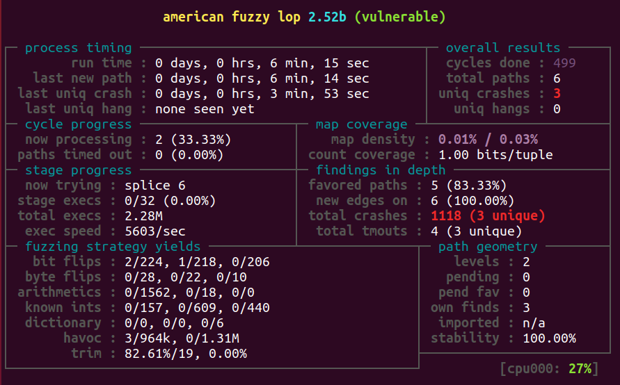

These instructions lead you through setup and fuzzing of a sample program.

# Setup

Jump to the appropriate part of this Setup section based on what you're configuring, then go to the next section
(Building AFL).

## Logging in to the provided instance

If you're reading these instructions then you've probably already made it! Skip to the vulnerable program section.

## Running the docker image locally

See the "Running locally" section of docker/README.md, then skip to the vulnerable program section.

## Setting up your own machine manually

Install dependencies (this is more than you need just for AFL, but you'll end up wanting these during the workshop; see
the Dockerfile for a comprehensive list of dependencies for all of the challenges):

    $ sudo apt-get install git build-essential curl libssl-dev sudo libtool libtool-bin libglib2.0-dev bison flex automake python3 python3-dev python3-setuptools libpixman-1-dev gcc-9-plugin-dev cgroup-tools \
    clang-11 clang-tools-11 libc++1-11 libc++-11-dev libc++abi1-11 libc++abi-11-dev libclang1-11 libclang-11-dev libclang-common-11-dev libclang-cpp11 libclang-cpp11-dev liblld-11 liblld-11-dev liblldb-11 liblldb-11-dev libllvm11 libomp-11-dev libomp5-11 lld-11 lldb-11 python3-lldb-11 llvm-11 llvm-11-dev llvm-11-runtime llvm-11-tools

Work around some Ubuntu annoyances

    $ sudo update-alternatives --install /usr/bin/clang clang `which clang-11.0` 1
    $ sudo update-alternatives --install /usr/bin/clang++ clang++ `which clang++-11.0` 1
    $ sudo update-alternatives --install /usr/bin/llvm-config llvm-config `which llvm-config-11.0` 1
    $ sudo update-alternatives --install /usr/bin/llvm-symbolizer llvm-symbolizer `which llvm-symbolizer-11.0` 1

Get, build, and install afl:

```shell
    $ git clone https://github.com/AFLplusplus/AFLplusplus
    $ cd AFLplusplus
    $ git checkout 2.68c # if you want a specific version, otherwise skip this step
    $ make distrib
    $ sudo make install
```

Make system not interfere with crash detection, plus some other tweaks:

    $ ~/AFLplusplus/afl-system-config

# The `vulnerable` program

Build our quickstart program using the instrumented compiler:

    $ cd quickstart
    $ CC=afl-clang-fast AFL_HARDEN=1 make

Test it:

    $ ./vulnerable
    # Press enter to get usage instructions.
    # Test it on one of the provided inputs:
    $ ./vulnerable < inputs/u

# Fuzzing

Fuzz it:

    $ afl-fuzz -i inputs -o out ./vulnerable

Your session should soon resemble this: 

For comparison you could also test without the provided example inputs, e.g.:

    $ mkdir in
    $ echo "my seed" > in/a
    $ afl-fuzz -i in -o out ./vulnerable
